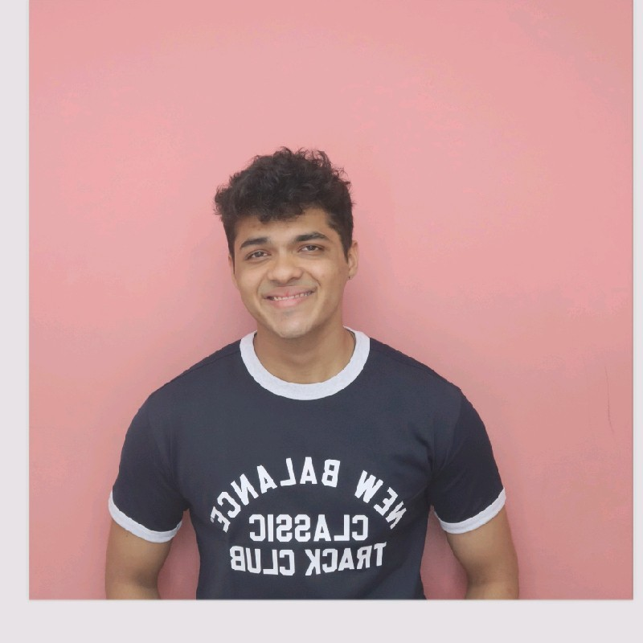

<!-- Center the image using HTML with inline CSS -->

  

Hello! I'm a Research Scientist at Intel Labs specializing in designing efficient computer systems.

My research focuses on workload analysis, performance engineering, and improving memory management for key workloads such as DNN training, LLM inference, etc. You'll either find me analyzing cache-miss rates or lying in agony at the gym after failing a PR.

Feel free to explore my [technical musings](/) to learn more about my interests.

  
  

---

If you'd like to get in touch, you can reach me at [mail](mailto:sathvikswaminathan@gmail.com).
